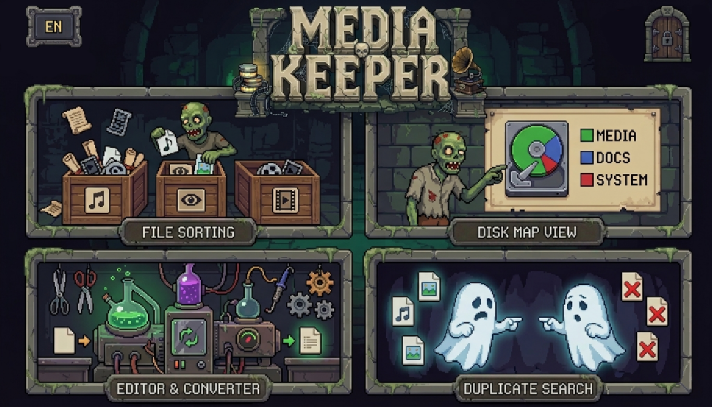
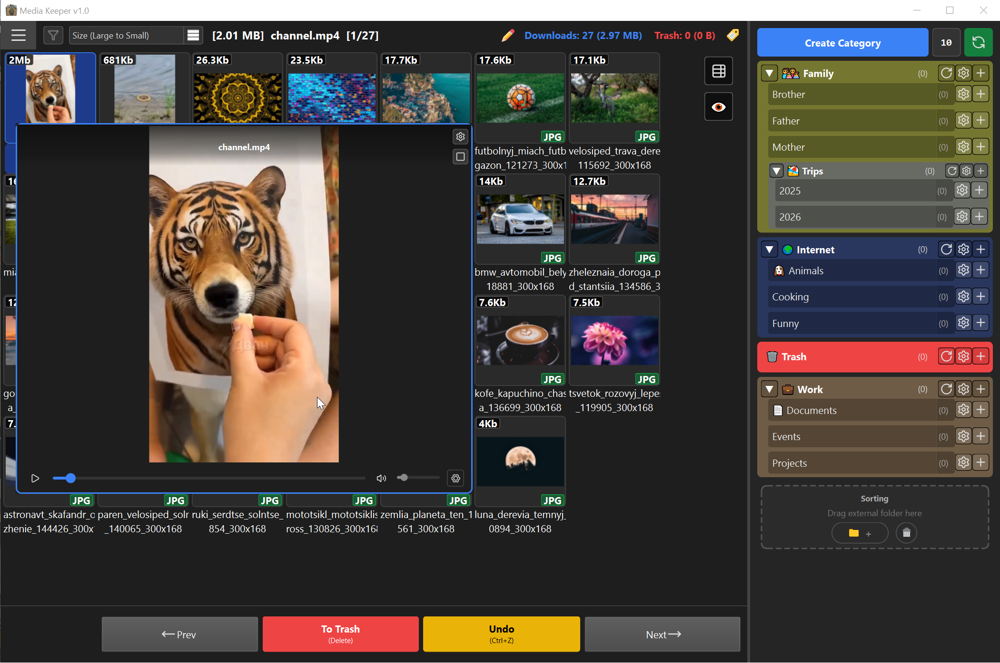
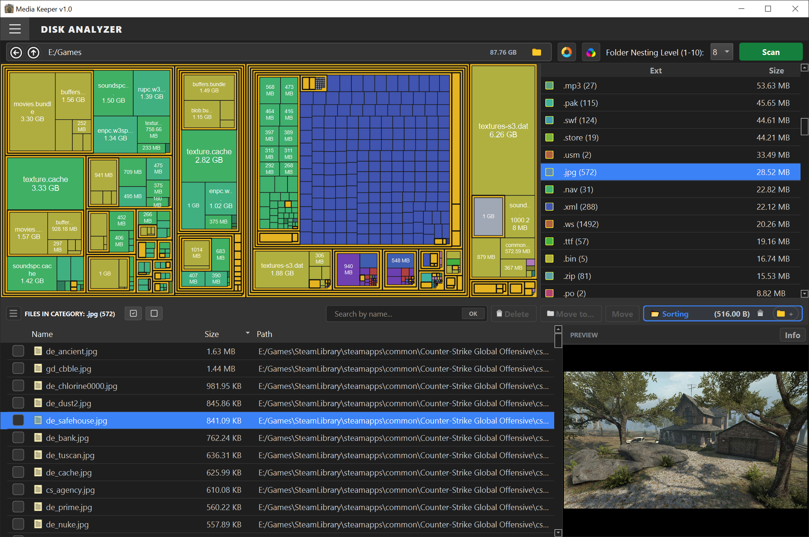
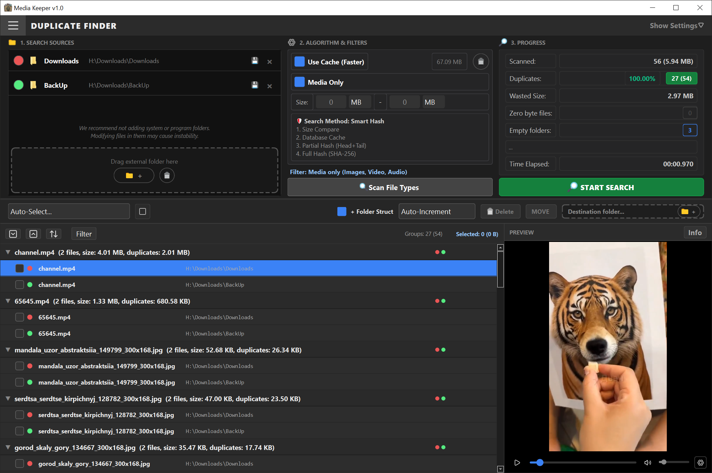
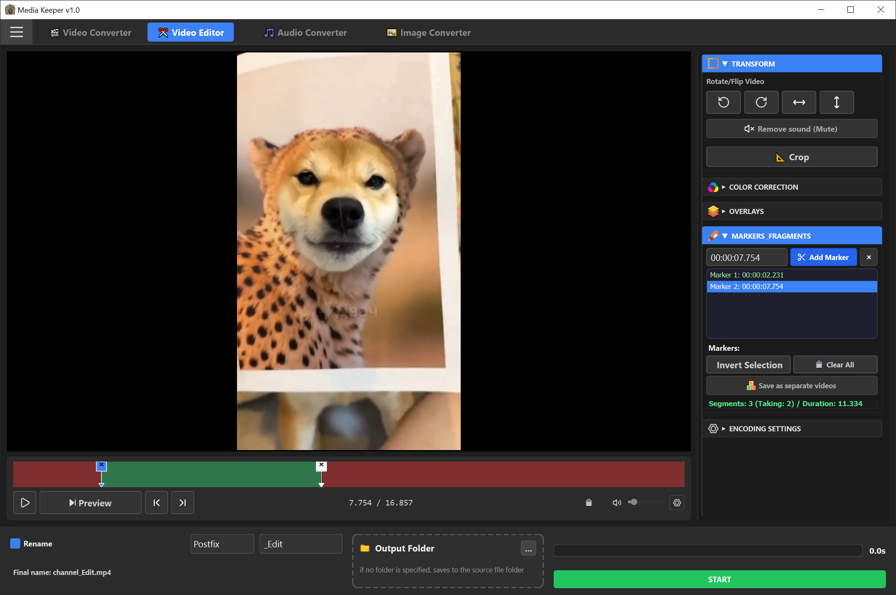

# Media Keeper 📂✨

[](https://github.com/scenthron/Media-Keeper/releases)

*🇬🇧 English | [🇷🇺 Русский](README_ru.md)*

**An offline utility suite for easy sorting, deep disk analysis, safe duplicate removal, and quick media editing.**

Media Keeper is a powerful and fully private application for organizing, cleaning, and processing your media archive. It combines all the necessary tools for working with images, video, and audio in daily life, keeping the interface clean, intuitive, and free from bloated settings.

---

## 💎 Key Features

*   **🛡️ 100% Privacy and Security:**
    *   Works completely **without an internet connection**. All operations are performed exclusively locally.
    *   The application **does not collect**, **does not transfer**, and **does not send** any files, metadata, or logs to third parties.
    *   There are **no** hidden cloud services or AI systems in the program.
*   **⚡ Easy and Live UI (TITAN Design System):**
    *   Modern dark theme with an adaptive layout.
    *   The style of some elements is inspired by the cult pixel game **Graveyard Keeper**.
    *   **Drag & Drop** support for quick folder analysis and parameter configuration.
    *   Convenient and customizable hotkey system.
*   **🔌 Portability (Portable):**
    *   No installation required. Runs from any media (USB flash drive, external drive).

---

## 📂 Application Screenshots

### Main Screen (Launcher)


---

## 🛠️ Main Modules

### 1. 📂 Media Sorter (Sorter)
Designed for convenient interactive viewing of media and other file types, and quick sorting of files into target folders in a single click.

*   **Workflow:** Choose the source folder (Inbox) ➡️ Specify target folders or create new folders on the go ➡️ Set the Trash folder ➡️ Sort files by clicking the directory tree or pressing a hotkey.
*   **Key Features:**
    *   **3 View Modes:** Grid (default), List, and Individual View.
    *   **Quick Preview:** Instant preview of images, audio, and video on hover or click.
    *   **Smart Filters:** File type filtering at the inbox and "Include Subfolders" option (recursive scanning).
    *   **Affix Panel (Tags):** Quick addition of prefixes, suffixes, and date/time tags to a group of files (up to 40 items) with preliminary transaction simulation (Dry Run) to protect against name conflicts.
    *   **Safe Undo:** Cancel the last move/rename action by pressing `Ctrl + Z`.
    *   **Zooming:** Zoom in/out of the displayed content in Grid and List modes using `Ctrl + Mouse Scroll`.
    *   **Tree Customization:** Focus on a specific tree branch, custom folder icons from the built-in library.



---

### 2. 📊 Disk Space Analyzer (Analyzer)
Visualizes disk space utilization of folders and files, helping to quickly find the "heaviest" directories and files.

*   **Workflow:** Select a folder to scan ➡️ The chart is generated automatically ➡️ Navigate through sectors for detailed analysis.
*   **Key Features:**
    *   **Interactive Charts:** Supports two modes — circular (**Sunburst**) and flat tile visualization (**TreeMap** using the Squarified algorithm).
    *   **Quick Control:** Change nesting depth using the combo box or mouse scroll on hover. Button for randomly changing the color palette.
    *   **Central Overlay:** Navigation buttons (Back, Up one level) and display of the selected folder's size right in the center of the scene.
    *   **Double Details:** The right table groups files by extensions, while the bottom table shows specific files in the selected category with optional directory grouping.
    *   **Context Folder Analysis:** Quick navigation to the detailed analysis of any file's parent folder.
    *   **Quick Search:** Smart search by file names in the scanned directory structure.



---

### 3. 🔍 Duplicate Finder (Cleaner)
Helps clean the disk from duplicate files based on hash sum calculations (even if the files have been renamed).

*   **Workflow:** Add source folders ➡️ Configure scanned file types ➡️ Run the scan ➡️ Apply auto-filters or manually select duplicates ➡️ Delete or move them to the target folder for analysis.
*   **Key Features:**
    *   **🛡️ Iron Rule of Safety (N-1):** The program physically prevents marking and deleting all files from a duplicate group. At least one original file always remains unmarked (the "survivor").
    *   **Folder Protection & Reference Mode:** You can set one of the folders as "Reference". Duplicates will only be searched for files in this folder, while the reference files themselves are protected from deletion.
    *   **Preserve Folder Structure:** Moving duplicates to an archive folder preserves the original nested directory structure for safe recovery.
    *   **Corrupted Files & Empty Folders:** Finding files of 0 bytes and empty directories for subsequent cleanup.
    *   **Smart Sorting:** Ordering duplicate groups by their processing state.



---

### 4. 🎬 Video Editor & Converters (Editor)
Combines the capabilities of quick lossless video cutting, cropping, and batch conversion of media files.

*   **Video Editor:** Video processing with instant live preview.
    *   **Transformation:** Rotation, mirroring, cropping (Crop).
    *   **Color Correction:** Adjusting brightness, contrast, saturation, and gamma.
    *   **Overlays:** Adding blur to a selected region (Blur), solid color fill, or logo images.
    *   **Fragment Markers:** Quick video cutting or splitting into segments with the ability to export them as separate files.
*   **Batch Converters (background mode):**
    *   **Video Converter:** Changing codecs (H.264 / H.265), adjusting resolution, and bitrate (CRF) with the ability to compress videos to a specific size limit (for messengers).
    *   **Audio Converter:** Audio compression and conversion to MP3, AAC, FLAC with CBR/VBR support, extracting audio tracks from video.
    *   **Image Converter:** Batch resizing, changing formats (PNG, JPG, WebP), and quality settings.



---

## 🚀 Installation & Launch (for developers)

### System Requirements
*   Python 3.10 or newer
*   Operating System: Windows 10/11 (for compilation and full functionality)
*   **FFmpeg:** Required for the video editor and converters. The program will automatically offer to download and install it to its system directory `.mediakeeper/bin/` upon first launch.

### Installation Steps
1. Clone the repository:
   ```bash
   git clone https://github.com/scenthron/Media-Keeper.git
   cd Media-Keeper
   ```
2. Create and activate a virtual environment (recommended):
   ```bash
   # Create virtual environment
   python -m venv venv

   # Activate virtual environment (Windows)
   venv\Scripts\activate
   ```
3. Install dependencies:
   ```bash
   pip install -r requirements.txt
   ```
4. Run the application via the manager script (it automatically runs tests before launching):
   ```bash
   python run.py
   ```

---

## 📦 Compilation to Executable (.exe)

Compilation is carried out using the custom script `build.py`, which optimizes the EXE size, automatically imports the required QtSvg modules, and includes resource folders:

```bash
python build.py
```
After compilation is complete, the ready `.exe` file will appear in the root folder `dist/`.

---

## 🤖 Automatic Cloud Build (CI/CD)

The repository has a configured **GitHub Actions** workflow (file [.github/workflows/build.yml](.github/workflows/build.yml)):
*   Every `git push` to the `master` branch triggers a test build, the artifact of which can be downloaded in the **Actions** tab (stored for 30 days).
*   Upon publishing a **Release** on GitHub, the robot automatically compiles a clean Windows version of the application, zips it, and attaches it to the release as a ready distribution.

---

## 📜 History of Creation
Media Keeper was born out of many separate scripts for routing tasks that the author created for his own needs. The desire to combine this functionality in a single application remained unfulfilled for a long time since the author is not a professional programmer.

The emergence of modern neural networks (specifically, the **Google Antigravity** AI assistant) opened up new opportunities and allowed to merge all concepts and ideas into a single product.

The program's name is inspired by the author's love for the pixel game **Graveyard Keeper**, some design elements of which you can meet in the interface.

---

## ⚖️ License

The project is distributed under the **MIT License with Non-Commercial Restriction**.
You are free to study, modify, and use the project for personal purposes with mandatory attribution. Commercial use of the program and its parts without the author's permission is strictly prohibited. For details, see the [LICENSE](LICENSE) file.

---

## 📬 Contact & Support
*   💬 GitHub Issues: [GitHub — Media Keeper](https://github.com/scenthron/Media-Keeper)
*   💬 Discord: `Centhron`
*   📧 E-mail: media.keeper.fb@gmail.com

### 💸 For those wishing to support the author financially:
*  DonationAlerts: https://dalink.to/centhron_s
*  Boosty.to: https://boosty.to/centhron

---
*Special thanks to friends for testing and to Google for the Antigravity neural network family!* 😊
